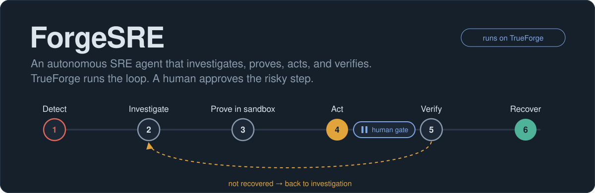
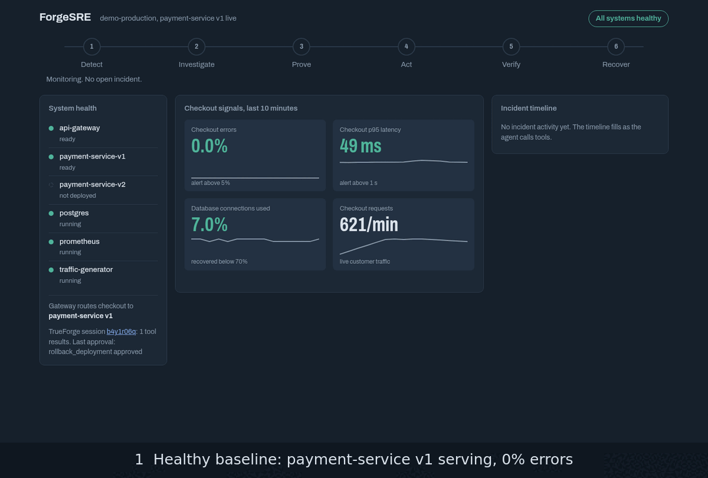
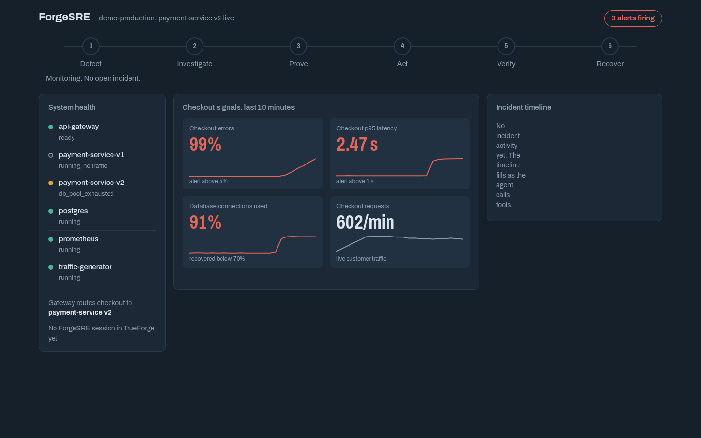
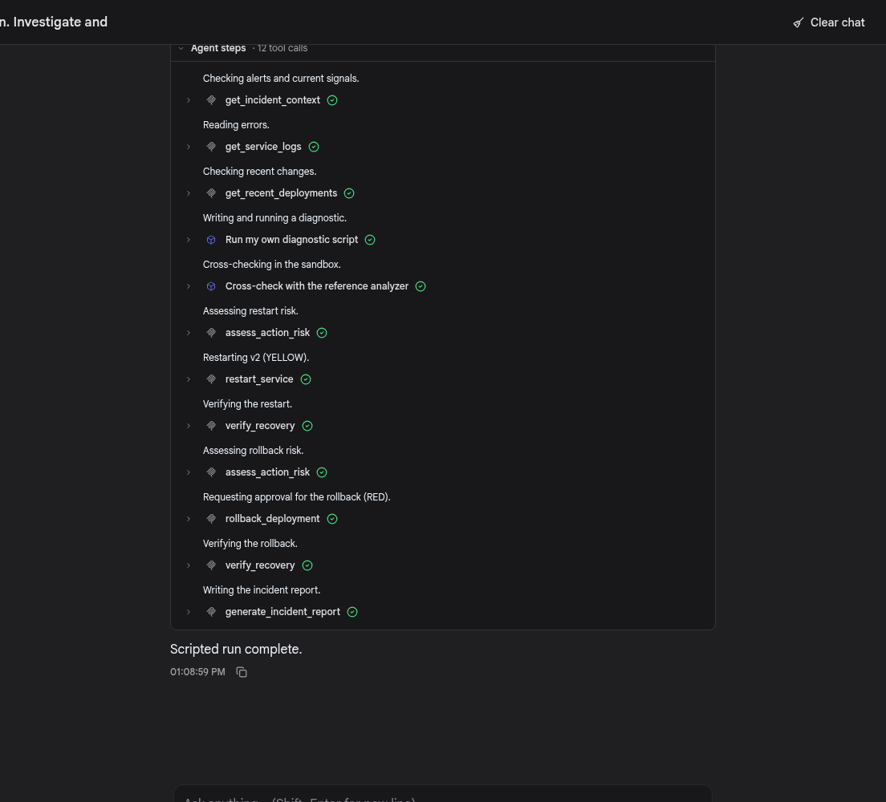
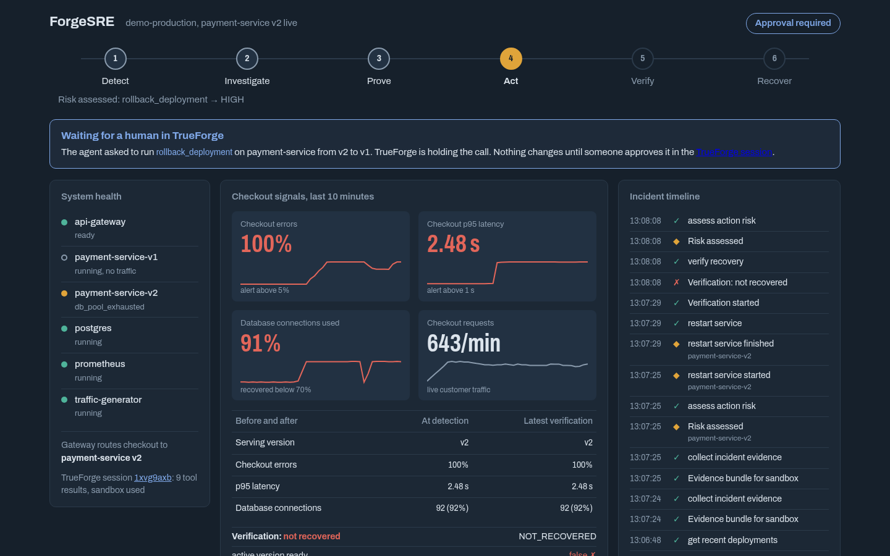
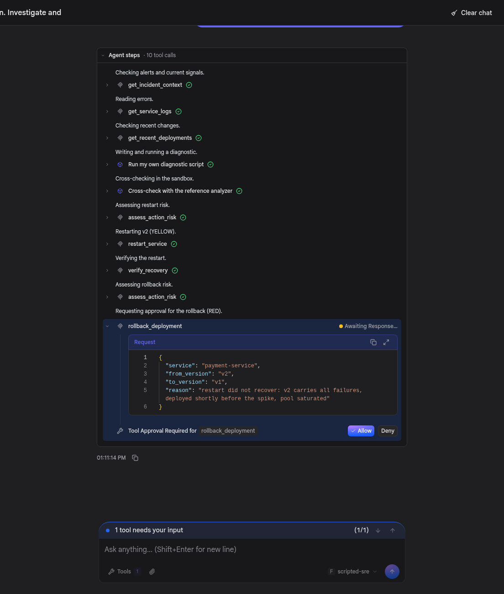
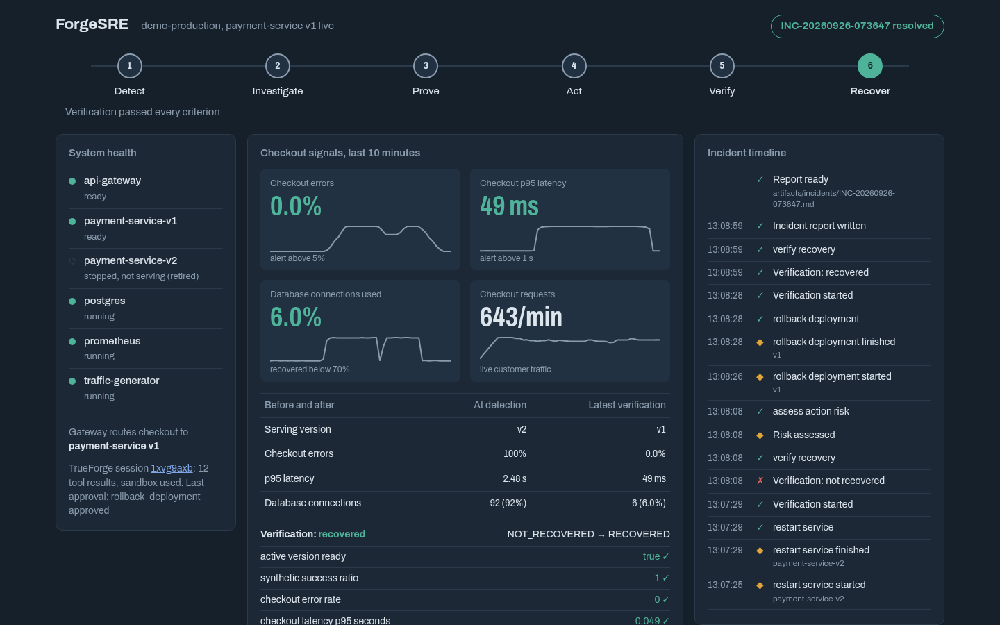
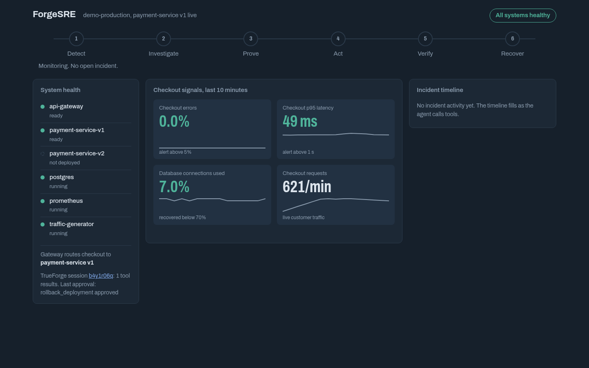
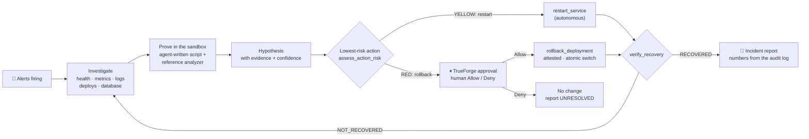

<p align="center">
  
</p>

<p align="center">
  <b>An autonomous SRE agent that runs on TrueForge.</b><br>
  It investigates a live production incident, proves its hypothesis with code it writes in the TrueForge sandbox,<br>
  fixes what it is allowed to fix, and stops for a human before it rolls back production.
</p>

<p align="center">
  
  
  
  
  
</p>

<p align="center">
  <a href="#quickstart"><b>Quickstart</b></a> ·
  <a href="#showcase"><b>Showcase</b></a> ·
  <a href="#where-it-stops"><b>Where it stops</b></a> ·
  <a href="docs/architecture.md"><b>Architecture</b></a> ·
  <a href="docs/README.md"><b>Docs</b></a> ·
  <a href="docs/judging-map.md"><b>Judging map</b></a>
</p>

---

> Monitoring tells you production broke. **ForgeSRE finds out why, proves it, acts safely, and shows that production
> actually recovered.** Built for the TrueFoundry × Polaris **Agents That Act** hackathon.

## In 30 seconds

| | |
|---|---|
| **The job** | First response to production incidents: database pool pressure or processor-latency regression, with evidence-driven diagnosis and safe recovery. |
| **What the agent does** | Reads alerts, metrics, logs, deploy history and the database; **writes and runs a diagnostic in the TrueForge sandbox**; forms a hypothesis with evidence; tries the safe fix; **verifies it** — and when the safe fix doesn't work, goes back to the evidence. |
| **Where it stops** | Before a production rollback. TrueForge holds the call and shows a human the exact arguments. Our server refuses to act unless TrueForge's own record shows that person allowed *this exact* call. |
| **How it proves it worked** | `verify_recovery` checks readiness, 20 synthetic checkouts, error rate, p95 and database load against thresholds in config. "Looks fixed" is not a verdict. |
| **What TrueForge does** | Everything agentic: the loop, tool routing, the sandbox, the approval pause, the session record. This repo has **no LLM client** and no agent loop of its own. |

## Showcase

<p align="center">
  
</p>

<table>
  <tr>
    <td width="50%" valign="top"><br><sub><b>1 · The incident.</b> Release v2 ships. Checkout errors hit 100 %, p95 2.5 s, PostgreSQL at 92 % of its connections, three alerts firing.</sub></td>
    <td width="50%" valign="top"><br><sub><b>2 · TrueForge runs the agent.</b> Every step is a real MCP call. The two cube icons are sandbox runs: a script the agent wrote, then the reference analyzer.</sub></td>
  </tr>
  <tr>
    <td width="50%" valign="top"><br><sub><b>3 · The restart didn't fix it.</b> Verification says NOT_RECOVERED, so the agent escalates. Mission control shows TrueForge holding the rollback.</sub></td>
    <td width="50%" valign="top"><br><sub><b>4 · The human gate.</b> TrueForge's native approval panel: <code>rollback_deployment</code> v2 → v1 with the agent's reason. Allow or Deny.</sub></td>
  </tr>
  <tr>
    <td width="50%" valign="top"><br><sub><b>5 · Verified recovery.</b> Traffic back on v1, v2 retired, errors 0 %, p95 50 ms, database 7 %. Loop complete: RECOVERED.</sub></td>
    <td width="50%" valign="top"><br><sub><b>6 · Back to baseline.</b> <code>./scripts/reset-demo.sh</code> restores a verified healthy state in about a minute, every time.</sub></td>
  </tr>
</table>

<sub>Captured from a live run by <code>scripts/dev/capture_showcase.py</code>. For reproducible pictures the session used a scripted
stand-in model; every tool call, the sandbox, the approval and all system state are real. The report it produced:
<a href="artifacts/incidents/example-contract-test-approved.md">approved run</a> ·
<a href="artifacts/incidents/example-contract-test-denied.md">denied run</a>.</sub>

## How it works



**Action ≠ success.** The restart *succeeds* — the container comes back in four seconds — and the incident is still
there, because the defect is in the code of v2. The agent only learns that by measuring. That closed loop (act,
measure, decide again) is the job, and it is why the rollback exists in the story at all.

The incident is real: payment-service v2 batches audit transactions in groups of 100 on an 85-connection pool, so
nothing ever commits and every audited payment strands a connection `idle in transaction`. Nothing in the tools, the
deployment metadata or the commit history says "v2 is broken" — the agent has to work it out. Details:
[architecture §6](docs/architecture.md#6-the-demo-production-system).

## Where it stops

| Class | Tools | Who decides | Enforced by |
|---|---|---|---|
| 🟢 **GREEN** | health, logs, metrics, database, deployments, evidence, risk, verification, report | the agent | — |
| 🟡 **YELLOW** | `restart_service` | the agent, if `assess_action_risk` shows no blockers | allowlist · 2 per 10 min per target · `postgres` never |
| 🔴 **RED** | `rollback_deployment` | **a human** | TrueForge `require_approval_for_tools` **and** server-side attestation |
| ⛔ **never** | shell, raw Docker, raw PromQL/SQL, deletes, DB writes | nobody | not exposed at all |

The boundary sits where reversibility ends: a restart changes no code or data; a rollback changes what code serves
every customer. Before calling it, the agent must write an **approval brief** — hypothesis, evidence, what it already
tried and how verification went, blast radius from `assess_action_risk`, and the recovery plan.

The rollback is protected twice:

1. **TrueForge** pauses the call and shows the arguments. On *Deny* the MCP server never even receives it.
2. **ForgeSRE** re-checks before touching anything: it finds the human *Allow* for this exact service/from/to in
   TrueForge's session record, refuses to reuse an approval, and validates that `from` is live, `to` exists and is
   ready, and an incident is open. Calling the endpoint directly changes nothing (`APPROVAL_NOT_FOUND`).

More: [architecture §5](docs/architecture.md#5-the-approval-boundary-two-layers).

## Why TrueForge is central

| TrueForge capability | How ForgeSRE uses it |
|---|---|
| Agent execution loop | The whole incident lifecycle — we ship no loop and no LLM client |
| Remote MCP connector (header auth) | Every production read and action |
| Tool annotations + `require_approval_for_tools` | `restart_service` runs; `rollback_deployment` pauses for a human |
| Native approval UI (`user.tool_approval`) | The rollback decision — which our server reads back to attest |
| Sandbox as a tool + Code Mode | The agent's own diagnostic code; evidence arrives through the harness-bridged `mcp_client`, so no credentials enter the sandbox |
| Skills (git-backed) | `skills/incident-diagnostics`, cloned into the sandbox where it can install |
| Sessions · events · turns API | Trace, dashboard approval banner, attestation, headless driver, tests |
| Local sandbox or Daytona | Local SRT sandbox by default; Daytona with `DAYTONA_API_KEY` |

> The model decides what action may help. TrueForge decides whether that action is allowed to execute.

## Quickstart

**You need:** Docker with Compose v2 · Node.js ≥ 22.14 · [uv](https://docs.astral.sh/uv/) · a model key.
TrueForge's local sandbox covers **Linux** (needs `bubblewrap socat ripgrep`) and **macOS** (built in). On Windows use
WSL2, or set a Daytona key (`write:sandboxes`, `write:snapshots`, `delete:snapshots`).

### 1. Install

```bash
git clone https://github.com/kartikeyajay2006/Agent_that_act-Hackathon.git forgesre && cd forgesre
./scripts/setup.sh        # checks prerequisites, creates .env with random secrets, builds images
```

### 2. Choose the model

Open `.env` and choose a low-latency, tool-capable model from the configured provider's current catalog. Set
`MODEL_PROVIDER`, `MODEL_ID`, and `MODEL_API_KEY` (plus `MODEL_BASE_URL` when required); `setup-trueforge.sh` validates
that the model is visible through TrueForge. Model selection is environment-driven rather than pinned in application
code. See the [stage model and offline backup runbook](docs/stage-model.md). Keep model credentials in `.env`; never
commit them or put them in a recording.

### 3. Bring up the read-only investigator

The first-milestone profile is the separate saved agent `forgesre-investigator`; it is restricted to observation tools
and has no sandbox, probes, restart, or rollback tools. Run `./scripts/up.sh` and `./scripts/doctor.sh`, then use
`./scripts/run-investigation.sh` for a read-only run. TrueForge `0.2.1` exposes URL-backed MCP manifests, not stdio.
Setup reads the installed OpenAPI schema and refuses loopback registration instead of weakening outbound protections.
For a deployment with an approved reachable MCP endpoint, configure `FORGESRE_MCP_URL` to its authenticated HTTPS
`/mcp` URL. Do not publish the local development server to bypass the policy.

TrueForge's local sandbox supports Linux (with `bubblewrap socat ripgrep`) and macOS; use WSL2 or a configured Daytona
sandbox for other environments. The optional `DAYTONA_API_KEY` belongs only in local `.env`.

### Scheduled read-only on-call investigation

TrueForge schedules can run the saved investigator unattended. Configure `TRUEFORGE_SCHEDULE_NAME`,
`TRUEFORGE_SCHEDULE_CRON`, `TRUEFORGE_SCHEDULE_TIMEZONE`, and `TRUEFORGE_SCHEDULE_TASK` in your ignored local `.env`;
the agent defaults to the saved read-only profile, and any explicitly selected agent is checked against its exact
observation-only tool allowlist. Cron is a standard five-field expression and TrueForge enforces a minimum one-hour
interval. No schedule is created by setup. Run `./scripts/setup-investigation-schedule.sh` to create or update it in
the **paused** state, then inspect the task, cadence, and agent in TrueForge. Only after that review, pass
`--activate` to explicitly enable recurring runs. Each run is visible as a session in TrueForge; approval-required
events are not answered by this integration, and the scheduled investigator has no remediation tools.

### 4. Run the full incident demo

The full recovery flow uses the separate action-capable `forgesre` profile. Enable it explicitly with
`./scripts/setup-trueforge.sh --full`; the read-only investigator remains unchanged. This demo can restart the
configured service and pauses at the rollback approval gate. Only run it against the local demo stack when you intend
to rehearse those actions.

```bash
./scripts/trigger-incident.sh
./scripts/verify-incident.sh
```

In TrueForge, use the incident prompt from `agent/demo-prompts.md`, then review and explicitly decide any
approval-required rollback. The alternate latency scenario uses the same tool surface; see [the demo runbook](docs/demo.md).

Before recording, `./scripts/demo-ready.sh` runs preflight and healthy-baseline checks. `./scripts/rehearse.sh` guides
real-model rehearsal; `./scripts/eval.sh` runs configured evaluation cases. See the [submission checklist](docs/submission-checklist.md).

The full agent is available in TrueForge after `setup-trueforge.sh --full`; the read-only profile remains available
for investigations and scheduled polling.

| Open | URL |
|---|---|
| TrueForge, read-only | http://localhost:8790 → **Agents → forgesre-investigator → Try** |
| TrueForge, full demo (after `--full`) | http://localhost:8790 → **Agents → forgesre → Try** |
| Mission control | http://127.0.0.1:18900/dashboard |

### Before recording or presenting

```bash
./scripts/demo-ready.sh               # up + doctor + healthy baseline, then prints the five demo steps
./scripts/rehearse.sh 3               # three guided real-model runs: reset, trigger, you prompt and approve
./scripts/eval.sh                     # scored runs: approve, deny, false alarm (see "Agent evaluation")
```

A rehearsal counts only if the agent reaches the gate, the rollback runs after Allow, verification says `RECOVERED`,
and a report is written — the same things `eval.sh` checks automatically.

### No model key yet?

```bash
./scripts/rehearse.sh --scripted
```

A scripted stand-in model drives the saved agent so you can see the whole flow; TrueForge, the tools, the sandbox and
the approval gate are all real, and **you** click Allow or Deny in the TrueForge UI. It is a rehearsal and test aid,
not the agent.

### Fresh-laptop check

A teammate on a clean macOS or Linux machine should get to a healthy baseline in under 15 minutes using only:

```bash
./scripts/setup.sh && ./scripts/preflight.sh && ./scripts/up.sh
```

If anything fails, fix the README or the script and time it again. Scripts use LF line endings via `.gitattributes`.

## MCP tools

<details>
<summary><b>17 tools</b> — narrow, validated, bounded (click to expand)</summary>

| Tool | Class | Purpose |
|---|---|---|
| `get_incident_context` | GREEN | Firing alerts, current signals; opens the incident |
| `list_services` · `get_service_health` | GREEN | Container state, restarts, `/health`, `/ready`, which version serves traffic |
| `get_service_logs` | GREEN | Filtered, bounded JSON logs with per-event counts and first/last seen |
| `query_metrics` | GREEN | 14 named Prometheus signals (no raw PromQL) |
| `get_database_health` | GREEN | Connections by client and state, utilization |
| `get_recent_deployments` · `get_active_deployment` | GREEN | Objective history; route observed live at the gateway |
| `collect_incident_evidence` | GREEN | Aligned time series + log buckets + deploys, for sandbox analysis |
| `get_reference_analyzer` | GREEN | Analyzer source, fetched into the sandbox through the MCP bridge |
| `assess_action_risk` | GREEN | Deterministic blast radius: request rate, dependents, target readiness, blockers |
| `get_incident_timeline` | GREEN | Recorded events for the open incident |
| `run_synthetic_check` | probe | Marked checkout requests through the public gateway |
| `verify_recovery` | probe | Verdict against `config/verification.yaml`, post-action window only |
| `restart_service` | YELLOW | Restart an allow-listed container, wait for liveness |
| `rollback_deployment` | RED | Approval-gated, attested, atomic traffic switch, previous version stopped |
| `generate_incident_report` | report | Markdown + JSON; timeline and numbers rendered from the audit log |

</details>

## Verified

| Suite | Result | What it proves |
|---|---|---|
| `uv run pytest` | **63 passed** | parsing, thresholds, report numbers, injection, allowlists, rate limit, rollback validation, attestation refusal and replay |
| `uv run pytest -m integration` | **12 passed** | on the live stack: incident appears, evidence is real, the right container restarts, restart ≠ recovery, rollback switches traffic, RECOVERED, reset works |
| `test_trueforge_lifecycle.py` · allow | **passed** | TrueForge routed 12 tool calls, 2 sandbox runs with bridged evidence, NOT_RECOVERED → RECOVERED, attested rollback, report RESOLVED |
| `test_trueforge_lifecycle.py` · deny | **passed** | same investigation; on Deny the rollback never reached the server, v2 untouched, report UNRESOLVED |
| `test_trueforge_gate.py` (real local model) | **passed** | deny: zero rollback calls reached the server; allow: executed with attestation |
| `./scripts/eval.sh --scenario approve --runs 1` (configured real model) | **100/100** | generated sandbox code, approval brief, gated rollback, objective recovery and a RESOLVED report |

Run them yourself: [docs/implementation.md → How it was verified](docs/implementation.md#how-it-was-verified).

## Repository

```text
agent/          instructions TrueForge runs · setup guide · demo prompts
config/         services · policy (who may do what) · verification thresholds
demo/           the production system: gateway, payment v1/v2/v3, Postgres, Prometheus, traffic
mcp-server/     the ForgeSRE MCP server (Python) + tests
skills/         incident-diagnostics skill (reference analyzer for the sandbox)
scripts/        up · doctor · setup · reset · trigger · verify · rehearse · run-agent
docs/           architecture · implementation · winning plan · map · judging map · demo · video script · build story
```

Full file-by-file map: [docs/map.md](docs/map.md).

## Documentation

| | |
|---|---|
| 🏗️ [**Full architecture**](docs/architecture.md) | components, lifecycle sequence, sandbox path, two-layer approval, state, security, failure handling |
| 🧭 [**Problem and what's implemented**](docs/implementation.md) | why this exists, what is built, how each part was verified, what we learned |
| 🏆 [**What we still need to win**](docs/winning-plan.md) | honest score against the rubric, must-dos before submission, live-demo risks |
| 🗺️ [**Repository map**](docs/map.md) | every file, "where do I change X", one rollback call traced through the code |
| ⚖️ [**Judging map**](docs/judging-map.md) | each judging criterion → code → evidence → what to show live |
| 🎬 [**Demo runbook**](docs/demo.md) | five-minute run of show and recording checklist |
| 🎥 [**Three-minute video script**](docs/video-script.md) | timestamped narration and exact on-screen actions for the submission video |
| 📣 [**Public build story**](docs/build-story.md) | ready-to-personalise social post for the optional community prize |
| ✅ [**Submission checklist**](docs/submission-checklist.md) | final technical, recording and public-submission checks |

## Known limitations

- The configured real model has completed the approval scenario at 100/100. Re-run `./scripts/eval.sh --scenario
  approve --runs 1` after changing the agent prompt or model; this is still a single-model, single-scenario result,
  not a claim of universal model reliability.
- Two configured incident scenarios and one versioned service; the latency scenario still needs an end-to-end
  rehearsal. The demo stack uses Docker Compose, not Kubernetes.
- Tested on Linux (Fedora). macOS should work (Docker Desktop, TrueForge's macOS sandbox); Windows needs WSL2.
- TrueForge local mode has no login; keep it on localhost. The approval attestation reads TrueForge's local API.
- On Fedora/RHEL, TrueForge's local sandbox can't clone git skills, so the analyzer is delivered through the MCP bridge
  instead (`FORGESRE_ATTACH_SKILL` to override).

## AI assistance

As the hackathon rules require: AI coding assistants (Claude Code and OpenAI Codex) were used for implementation,
tests, and documentation under the team's direction. The design decisions, the demo, and the submission are the
team's own, and the team can explain every part of the architecture.

## Contributors

- [@ankit25bcs10610](https://github.com/ankit25bcs10610)
