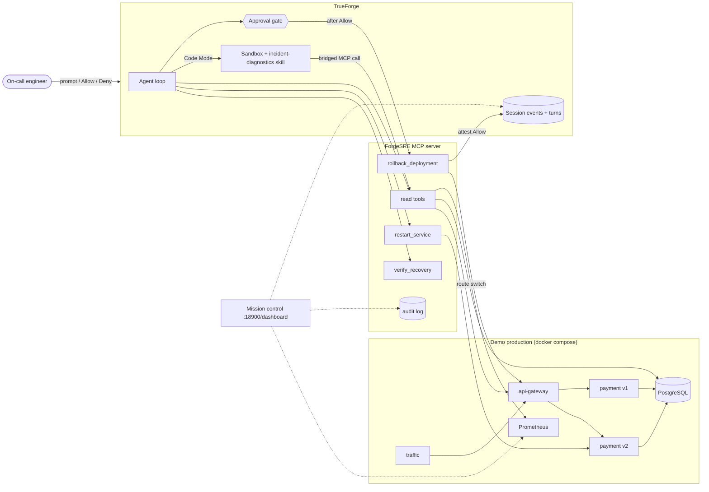

# ForgeSRE

**An autonomous production reliability agent that runs on TrueForge.** It investigates a live incident, proves its
hypothesis in the TrueForge sandbox, fixes what it is allowed to fix, stops for a human before a production rollback,
and only declares recovery when objective signals say so.

> Monitoring tells you something broke. ForgeSRE investigates why, acts on the system, and proves that production
> recovered.

Built for the TrueFoundry × Polaris **Agents That Act** hackathon.

## The problem

When checkout starts failing at 2 a.m., an on-call engineer checks alerts, graphs, logs, recent deploys and the
database, forms a theory, tries the cheapest fix, checks whether it worked, escalates the risky fix, and writes it all
up. Most of that is mechanical. The parts that are not — judging evidence and authorising risky changes — are exactly
where an agent needs hard boundaries.

## What ForgeSRE does

```text
alert → health → metrics → logs → deployments → database
      → sandbox diagnosis (computed from evidence)
      → hypothesis with evidence + confidence
      → restart (safe, autonomous) → verify → NOT recovered
      → risk assessment → rollback → ⏸ TrueForge approval → human allows
      → real traffic switch → verify → RECOVERED → incident report
```

Every arrow is a real MCP tool call, a real sandbox execution, or a real TrueForge approval event.

## 90-second example

```text
You      Checkout is failing in production. Investigate and recover the service.

ForgeSRE get_incident_context       3 alerts firing: CheckoutErrorRateHigh (100%), CheckoutLatencyHigh (2.48 s),
                                    DatabaseConnectionsHigh (92%)
         get_service_logs           payment-service-v2: db_pool_timeout ×2260, active_connections=85/85
         get_recent_deployments     payment-service v1 → v2 at 06:36:13
         get_database_health        85 connections from payment-service-v2, all "idle in transaction"
         sandbox: diagnose.py       failures 100% on v2 · v2 deployed 22 s before start · pool 1.0 · r=0.64 ·
                                    evidence_score 1.0 (6/6 checks)
         Hypothesis (HIGH)          v2 strands pooled connections in open transactions → pool exhaustion
         restart_service v2         ✓ container back in 4.1 s
         verify_recovery            ✗ NOT_RECOVERED — synthetic 0/20, errors 100%, DB 91%
         assess_action_risk         HIGH · 617 req/min · v1 ready · releases 85 DB connections · approval required
         rollback_deployment        ⏸ TrueForge: APPROVAL REQUIRED  → human clicks Allow
                                    ✓ gateway now routes to v1, v2 stopped (2.5 s)
         verify_recovery            ✓ RECOVERED — 20/20 synthetic, errors 0.0%, p95 49 ms, DB 7%
         generate_incident_report   artifacts/incidents/INC-20260926-060714.md
```

(Illustrative transcript: every number is a real tool result recorded while testing this stack, collected across
test runs of the individual steps.)

## Why TrueForge is central

ForgeSRE contains **no agent loop and no LLM client**. TrueForge runs the model, chooses tools, executes the sandbox,
enforces the approval pause, and stores the session. ForgeSRE contributes the production systems, a narrow MCP tool
surface, deterministic safety rules and evidence.

| TrueForge capability | How ForgeSRE uses it |
|---|---|
| Agent execution loop | The whole incident lifecycle |
| Remote MCP connector (header auth) | Every production read and action |
| Tool annotations + `require_approval_for_tools` | `restart_service` runs; `rollback_deployment` pauses for a human |
| Native approval UI (`user.tool_approval`) | The rollback decision, which the MCP server then re-verifies |
| Sandbox as a tool + Code Mode | Diagnostic analysis; evidence fetched via the harness-bridged `mcp_client` |
| Skills (git-backed) | `skills/incident-diagnostics`, cloned into the sandbox on demand |
| Sessions / events / turns API | Execution trace, dashboard approval banner, approval attestation, headless driver |
| Local sandbox or Daytona | Local SRT sandbox in standalone mode; Daytona when `DAYTONA_API_KEY` is set |

> The model decides what action may help. TrueForge decides whether that action is allowed to execute.

## Architecture



More detail, including the incident mechanics and rollback steps: [docs/architecture.md](docs/architecture.md).

## Incident lifecycle

| Phase | Tools | What makes it real |
|---|---|---|
| Detect | `get_incident_context` | Prometheus alert rules on user-facing symptoms; opens an incident |
| Investigate | `get_service_health`, `query_metrics`, `get_service_logs`, `get_recent_deployments`, `get_database_health` | Docker Engine API, Prometheus, container logs, `pg_stat_activity` |
| Prove | sandbox `diagnose.py` ← `collect_incident_evidence` | Computed from aligned time series, log buckets and deploy history |
| Act | `assess_action_risk`, `restart_service`, `rollback_deployment` | Container restart; atomic gateway route switch; previous version stopped |
| Verify | `verify_recovery`, `run_synthetic_check` | Thresholds from `config/verification.yaml`; post-action windows only |
| Recover | `generate_incident_report` | Timeline, actions and before/after rendered from the audit log |

## Safety model

| Class | Tools | Rule |
|---|---|---|
| GREEN | reads, probes, verification, report | Autonomous |
| YELLOW | `restart_service` | Autonomous if `assess_action_risk` has no blockers; allowlist + 2 per 10 min per target |
| RED | `rollback_deployment` | TrueForge approval gate, then server-side attestation |

The model is never the only boundary:

- **No shell, no raw Docker, no raw PromQL or SQL.** Metrics are named signals; services come from a catalog.
- **Strict inputs.** Names and versions are regex-validated and looked up; `postgres` can never be restarted.
- **Rollback validation.** Service allowlisted, `from_version` must be live, target must exist and pass `/ready`,
  an incident must be open, same-version requests return `ALREADY_AT_TARGET`.
- **Approval attestation.** Before switching traffic, the MCP server finds the human *Allow* for this exact call
  (service, from, to) in TrueForge's session record and refuses to reuse it. Calling the endpoint directly, or
  replaying an old approval, changes nothing (`APPROVAL_NOT_FOUND` / `APPROVAL_ALREADY_USED`).
- **Code Mode cannot bypass the gate.** TrueForge blocks destructive tools inside sandbox scripts.
- **Locked down by default.** Every port binds to 127.0.0.1, the MCP endpoint requires a bearer token, the database
  tool uses a `pg_monitor` role, logs are bounded and secrets redacted, the sandbox receives no credentials.

## Demo incident

`payment-service` v2 ships an audit trail: high-value payments get an audit row written in its own transaction on a
dedicated pooled connection, committed in batches of 100. The pool holds 85 connections, so a batch never fills and
every audited payment strands a connection `idle in transaction`. Within ~10 s the pool is exhausted and every
checkout waits 2 s and fails. A restart releases the connections — for about ten seconds. The fix is the previous
release.

Nothing in the tools or the deployment metadata says "v2 is broken". The agent has to work it out.

## MCP tools

| Tool | Class | Purpose |
|---|---|---|
| `get_incident_context` | GREEN | Firing alerts, current signals, open incident |
| `list_services` / `get_service_health` | GREEN | Container state, restarts, `/health`, `/ready`, which version serves traffic |
| `get_service_logs` | GREEN | Filtered, bounded JSON logs with per-event counts |
| `query_metrics` | GREEN | 14 named Prometheus signals with summaries and points |
| `get_database_health` | GREEN | Connections by client and state, utilization |
| `get_recent_deployments` / `get_active_deployment` | GREEN | Objective history; live gateway route |
| `collect_incident_evidence` | GREEN | Aligned evidence bundle for sandbox analysis |
| `assess_action_risk` | GREEN | Deterministic blast radius and blockers |
| `get_incident_timeline` | GREEN | Recorded events for the open incident |
| `run_synthetic_check` | probe | Marked checkout requests through the gateway |
| `verify_recovery` | probe | Objective verdict against configured thresholds |
| `restart_service` | YELLOW | Restart an allow-listed container, wait for liveness |
| `rollback_deployment` | RED | Approval-gated, attested, atomic traffic switch |
| `generate_incident_report` | report | Markdown + JSON report from recorded data |

## Human approval

Configured in the agent spec that `forgesre trueforge-setup` writes to TrueForge:

```json
"mcp_servers": [{
  "name": "forgesre",
  "enable_tools": ["@all"],
  "require_approval_for_tools": ["rollback_deployment", "@destructive"],
  "preload": true
}]
```

`rollback_deployment` is also annotated `destructiveHint: true`, so it would be gated even by TrueForge's default.
Verified end to end in `mcp-server/tests/test_trueforge_gate.py`: on **Deny** the MCP server never receives the call;
on **Allow** it executes and records the attestation (session, tool call, approving turn, time).

## Sandbox diagnosis

`skills/incident-diagnostics/scripts/diagnose.py` runs in the TrueForge sandbox. It pulls
`collect_incident_evidence` through `mcp_client` (bridged to the harness — no credentials in the sandbox) and
computes: incident start, baseline and peak error rate, latency, which upstream version carried the failures,
seconds from the last deployment to the start, pool and database saturation before/after, dominant backend error,
pool-vs-error correlation, the effect of any earlier restart, and an evidence score from six independent checks. The
suspect is derived from the data, never named in the code.

## Verification model

`verify_recovery` waits until `settle_seconds` have passed since the last action (so rate windows see only post-action
traffic), then requires **all** of:

| Criterion | Threshold (`config/verification.yaml`) |
|---|---|
| Active version `/ready` | true |
| Synthetic checkout success | ≥ 95% of 20 |
| Checkout error rate (30 s) | ≤ 5% |
| Checkout p95 latency | ≤ 1.0 s |
| PostgreSQL connection utilization | ≤ 70% |

Missing data counts as a failure.

## Running locally

Requirements: Docker with Compose v2, Node.js ≥ 22.14, [uv](https://docs.astral.sh/uv/), and for TrueForge's local
sandbox on Linux `bwrap`, `socat`, `ripgrep` (or a Daytona key). An API key for a model TrueForge supports.

```bash
cp .env.example .env            # or let setup.sh create it with random secrets
./scripts/setup.sh              # prerequisites, .env secrets, Python env, images
# put MODEL_PROVIDER / MODEL_ID / MODEL_API_KEY in .env

./scripts/start-demo.sh         # production stack + MCP server
./scripts/verify-healthy.sh
./scripts/start-trueforge.sh    # TrueForge 0.2.1, UI on http://localhost:8790
./scripts/setup-trueforge.sh    # model, MCP connector, skill, sandbox, agent + approval gate
```

| Variable | Meaning |
|---|---|
| `MODEL_PROVIDER` | `anthropic`, `openai`, `google-gemini`, `truefoundry`, `custom`, … (TrueForge catalog types) |
| `MODEL_ID` | Model id from TrueForge's catalog, e.g. `claude-sonnet-5` (setup validates it against the catalog) |
| `MODEL_API_KEY` | Provider key (stays in TrueForge) |
| `MODEL_BASE_URL` | Only for `custom` / `truefoundry` (OpenAI-compatible) |
| `DAYTONA_API_KEY` | Optional; otherwise TrueForge's local sandbox is used |
| `POSTGRES_PASSWORD`, `MONITOR_PASSWORD`, `FORGESRE_MCP_TOKEN` | Generated by `setup.sh` |

## Triggering the demo

```bash
./scripts/reset-demo.sh         # known-good baseline in about a minute
./scripts/trigger-incident.sh   # release pipeline ships payment-service v2
./scripts/verify-incident.sh    # waits until the incident is observable
```

Then in TrueForge (Agents → `forgesre` → Try) send:

```text
Production checkout failures are being reported. Investigate the incident, determine the root cause,
take safe recovery actions, and restore the system.
```

Or drive the same TrueForge session from a terminal: `./scripts/run-agent.sh` (asks you to Allow/Deny).
Watch **mission control** at http://127.0.0.1:18900/dashboard.

## Testing

```bash
cd mcp-server
uv run pytest                                   # 63 unit + safety tests (33 + 30), no infrastructure
uv run pytest -m integration                    # 12 tests against the live stack (~4 min)
uv run pytest -m trueforge -s tests/test_trueforge_lifecycle.py   # full lifecycle through TrueForge, allow + deny
uv run pytest -m trueforge -s tests/test_trueforge_gate.py        # approval gate with the configured real model
```

`test_trueforge_lifecycle.py` runs the saved `forgesre` agent spec inside TrueForge with the model swapped for a
**scripted test double** (`tests/scripted_model.py`), so it checks the integration — tool routing, sandbox, Code Mode
bridge, approval pause, attestation, real side effects, report — independently of model quality. Recorded results:

| Branch | Tool calls routed by TrueForge | Sandbox | Verdicts | Approval | Outcome |
|---|---|---|---|---|---|
| allow | 11 | created; analyzer computed suspect v2 from bridged evidence | NOT_RECOVERED → RECOVERED | 1 pause, attested | v1 live, report RESOLVED |
| deny | 9 | same | NOT_RECOVERED | 1 pause, denied | v2 untouched, rollback never reached the server, report UNRESOLVED |

Example reports from those runs: [approved](artifacts/incidents/example-contract-test-approved.md),
[denied](artifacts/incidents/example-contract-test-denied.md).

## Demo script

See [docs/demo.md](docs/demo.md) for the 2-minute run of show and recovery tips, and
[docs/judging-map.md](docs/judging-map.md) for where each claim lives in the code.

## Known limitations

- One incident scenario, one versioned service, Docker Compose rather than Kubernetes.
- TrueForge's Linux local sandbox cannot read `/usr/libexec`, so on Fedora/RHEL hosts git-backed skills fail to clone
  inside it (and would break sandbox start-up). `setup-trueforge.sh` detects this and, instead of attaching the skill,
  tells the agent to fetch the same analyzer over HTTPS into the sandbox. With Daytona or on Debian/Ubuntu the skill is
  attached normally (`FORGESRE_ATTACH_SKILL=auto|always|never`).
- The approval attestation searches recent TrueForge sessions over the local API; a multi-tenant deployment would
  pass a session-scoped identity instead.
- Local TrueForge mode has no login; keep it on localhost (as the TrueForge docs require).
- Model quality matters: small local models can drive the tools but reason poorly over long evidence.

## Future work

Kubernetes backend behind the same tools · more incident classes (memory leak, bad config, dependency outage) ·
subagents for parallel evidence collection · PagerDuty/Slack triggers via TrueForge schedules · incident memory
across sessions.
