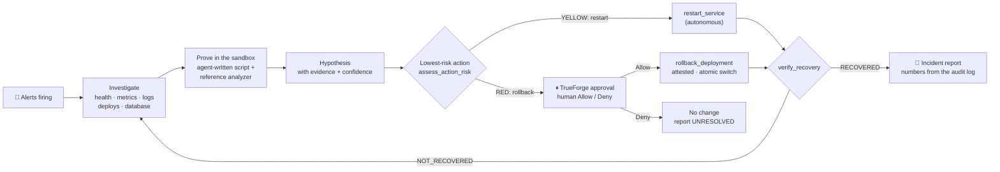
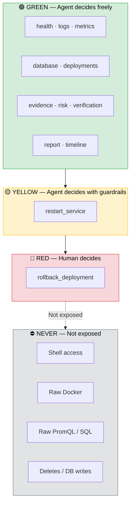
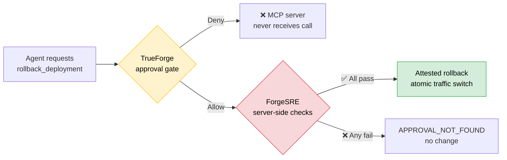

<p align="center">
  
</p>

<p align="center">
  <b>An autonomous SRE agent that runs on TrueForge.</b><br>
  It investigates a live production incident, proves its hypothesis with code it writes in the TrueForge sandbox,<br>
  fixes what it is allowed to fix, and stops for a human before it rolls back production.
</p>

<p align="center">
  
  
  
  
  
</p>

<p align="center">
  <a href="#quickstart"><b>Quickstart</b></a> ·
  <a href="#showcase"><b>Showcase</b></a> ·
  <a href="#where-it-stops"><b>Where it stops</b></a> ·
  <a href="docs/architecture.md"><b>Architecture</b></a> ·
  <a href="docs/README.md"><b>Docs</b></a> ·
  <a href="docs/judging-map.md"><b>Judging map</b></a>
</p>

---

> Monitoring tells you production broke. **ForgeSRE finds out why, proves it, acts safely, and shows that production
> actually recovered.** Built for the TrueFoundry × Polaris **Agents That Act** hackathon.

---

## In 30 seconds

| | |
|---|---|
| **The job** | First response to a production incident: checkout is failing and someone has to find out why and fix it, now. |
| **What the agent does** | Reads alerts, metrics, logs, deploy history and the database; **writes and runs a diagnostic in the TrueForge sandbox**; forms a hypothesis with evidence; tries the safe fix; **verifies it** — and when the safe fix doesn't work, goes back to the evidence. |
| **Where it stops** | Before a production rollback. TrueForge holds the call and shows a human the exact arguments. Our server refuses to act unless TrueForge's own record shows that person allowed *this exact* call. |
| **How it proves it worked** | `verify_recovery` checks readiness, 20 synthetic checkouts, error rate, p95 and database load against thresholds in config. "Looks fixed" is not a verdict. |
| **What TrueForge does** | Everything agentic: the loop, tool routing, the sandbox, the approval pause, the session record. This repo has **no LLM client** and no agent loop of its own. |

## Showcase

<p align="center">
  
</p>

<table>
  <tr>
    <td width="50%" valign="top"><br><sub><b>1 · The incident.</b> Release v2 ships. Checkout errors hit 100 %, p95 2.5 s, PostgreSQL at 92 % of its connections, three alerts firing.</sub></td>
    <td width="50%" valign="top"><br><sub><b>2 · TrueForge runs the agent.</b> Every step is a real MCP call. The two cube icons are sandbox runs: a script the agent wrote, then the reference analyzer.</sub></td>
  </tr>
  <tr>
    <td width="50%" valign="top"><br><sub><b>3 · The restart didn't fix it.</b> Verification says NOT_RECOVERED, so the agent escalates. Mission control shows TrueForge holding the rollback.</sub></td>
    <td width="50%" valign="top"><br><sub><b>4 · The human gate.</b> TrueForge's native approval panel: <code>rollback_deployment</code> v2 → v1 with the agent's reason. Allow or Deny.</sub></td>
  </tr>
  <tr>
    <td width="50%" valign="top"><br><sub><b>5 · Verified recovery.</b> Traffic back on v1, v2 retired, errors 0 %, p95 50 ms, database 7 %. Loop complete: RECOVERED.</sub></td>
    <td width="50%" valign="top"><br><sub><b>6 · Back to baseline.</b> <code>./scripts/reset-demo.sh</code> restores a verified healthy state in about a minute, every time.</sub></td>
  </tr>
</table>

<sub>Captured from a live run by <code>scripts/dev/capture_showcase.py</code>. For reproducible pictures the session used a scripted
stand-in model; every tool call, the sandbox, the approval and all system state are real. The report it produced:
<a href="artifacts/incidents/example-contract-test-approved.md">approved run</a> ·
<a href="artifacts/incidents/example-contract-test-denied.md">denied run</a>.</sub>

---

## How it works



**Action ≠ success.** The restart *succeeds* — the container comes back in four seconds — and the incident is still
there, because the defect is in the code of v2. The agent only learns that by measuring. That closed loop (act,
measure, decide again) is the job, and it is why the rollback exists in the story at all.

The incident is real: payment-service v2 batches audit transactions in groups of 100 on an 85-connection pool, so
nothing ever commits and every audited payment strands a connection `idle in transaction`. Nothing in the tools, the
deployment metadata or the commit history says "v2 is broken" — the agent has to work it out. Details:
[architecture §6](docs/architecture.md#6-the-demo-production-system).

---

## Where it stops



<table>
  <tr>
    <th>Risk class</th>
    <th>Tools</th>
    <th>Who decides</th>
    <th>Enforced by</th>
  </tr>
  <tr>
    <td>🟢 <b>GREEN</b></td>
    <td>health, logs, metrics, database, deployments, evidence, risk, verification, report</td>
    <td>The agent</td>
    <td>—</td>
  </tr>
  <tr>
    <td>🟡 <b>YELLOW</b></td>
    <td><code>restart_service</code></td>
    <td>The agent, if <code>assess_action_risk</code> shows no blockers</td>
    <td>Allowlist · 2 per 10 min per target · <code>postgres</code> never</td>
  </tr>
  <tr>
    <td>🔴 <b>RED</b></td>
    <td><code>rollback_deployment</code></td>
    <td><b>A human</b></td>
    <td>TrueForge <code>require_approval_for_tools</code> <b>and</b> server-side attestation</td>
  </tr>
  <tr>
    <td>⛔ <b>NEVER</b></td>
    <td>shell, raw Docker, raw PromQL/SQL, deletes, DB writes</td>
    <td>Nobody</td>
    <td>Not exposed at all</td>
  </tr>
</table>

The boundary sits where reversibility ends: a restart changes no code or data; a rollback changes what code serves
every customer. Before calling it, the agent must write an **approval brief** — hypothesis, evidence, what it already
tried and how verification went, blast radius from `assess_action_risk`, and the recovery plan.

### Two-layer rollback protection



> **Layer 1 — TrueForge** pauses the call and shows the arguments. On *Deny* the MCP server never even receives it.
>
> **Layer 2 — ForgeSRE** re-checks before touching anything: it finds the human *Allow* for this exact service/from/to in
> TrueForge's session record, refuses to reuse an approval, and validates that `from` is live, `to` exists and is
> ready, and an incident is open. Calling the endpoint directly changes nothing (`APPROVAL_NOT_FOUND`).

More: [architecture §5](docs/architecture.md#5-the-approval-boundary-two-layers).

---

## Why TrueForge is central

```mermaid
flowchart TB
    TF["🏗️ TrueForge"]

    TF --> L["🔄 Agent execution loop<br/>Full incident lifecycle —<br/>no loop or LLM client shipped"]
    TF --> M["🔌 Remote MCP connector<br/>Header auth · every<br/>production read and action"]
    TF --> A["🛡️ Tool annotations<br/>require_approval_for_tools<br/>restart runs, rollback pauses"]
    TF --> U["👤 Native approval UI<br/>Rollback decision —<br/>server reads back to attest"]
    TF --> S["📦 Sandbox + Code Mode<br/>Agent's own diagnostic code<br/>credentials never enter sandbox"]
    TF --> K["📚 Skills (git-backed)<br/>incident-diagnostics<br/>cloned into sandbox"]
    TF --> E["📊 Sessions API<br/>Trace, dashboard, attestation<br/>headless driver, tests"]
    TF --> D["💻 Local / Daytona<br/>Local SRT by default<br/>Daytona with API key"]

    style TF fill:#7fa7e6,stroke:#4a6fa5,color:#fff
    style L fill:#f0f4ff,stroke:#7fa7e6,color:#000
    style M fill:#f0f4ff,stroke:#7fa7e6,color:#000
    style A fill:#f0f4ff,stroke:#7fa7e6,color:#000
    style U fill:#f0f4ff,stroke:#7fa7e6,color:#000
    style S fill:#f0f4ff,stroke:#7fa7e6,color:#000
    style K fill:#f0f4ff,stroke:#7fa7e6,color:#000
    style E fill:#f0f4ff,stroke:#7fa7e6,color:#000
    style D fill:#f0f4ff,stroke:#7fa7e6,color:#000
```



> **The model decides what action may help. TrueForge decides whether that action is allowed to execute.**

---

## Quickstart

### Prerequisites

| Requirement | Version |
|:---|:---|
| 🐳 Docker with Compose | v2+ |
| 📦 Node.js | ≥ 22.14 |
| 🐍 [uv](https://docs.astral.sh/uv/) | latest |
| 🔑 A model API key | TrueFoundry gateway or OpenAI |

> **Platform:** Linux and macOS work out of the box. On Windows, use WSL2. Linux additionally needs `bubblewrap socat ripgrep`.

### Step 1 — Clone & setup

```bash
git clone https://github.com/kartikeyajay2006/Agent_that_act-Hackathon.git forgesre && cd forgesre
./scripts/setup.sh          # checks prerequisites, creates .env, builds images
```

### Step 2 — Add your model key

Put the real values in `.env` (git-ignored — never commit a key). The recommended setup is the **TrueFoundry AI
Gateway** with a light model that is dependable at tool calling:

```bash
MODEL_PROVIDER=truefoundry
MODEL_ID=openai-polaris/gpt-4.1-mini          # list yours: curl -H "Authorization: Bearer <token>" https://gateway.truefoundry.ai/models
MODEL_API_KEY=<TrueFoundry token>
MODEL_BASE_URL=https://gateway.truefoundry.ai

OPENAI_API_KEY=<optional: your OpenAI key>     # registered as a second provider you can switch to in the TrueForge UI
OPENAI_MODEL_IDS=gpt-4.1-mini,gpt-5.4-mini
```

Direct OpenAI works too: `MODEL_PROVIDER=openai`, `MODEL_ID=gpt-5.4-mini`, `MODEL_API_KEY=sk-…`. Reasoning models get
`reasoning_effort` (`MODEL_REASONING_EFFORT`, default `low`) instead of a temperature, so they don't error.

| Variable | Meaning |
|---|---|
| `MODEL_PROVIDER` | `truefoundry`, `openai`, `google-gemini`, `custom`, … (TrueForge provider types) |
| `MODEL_ID` | Gateway model id, or a model from TrueForge's catalog |
| `MODEL_API_KEY` · `MODEL_BASE_URL` | Provider key (stored in TrueForge, never in the agent spec) · gateway URL |
| `OPENAI_API_KEY` · `OPENAI_MODEL_IDS` | Optional fallback provider, selectable in the TrueForge model picker |
| `DAYTONA_API_KEY` | Optional cloud sandbox; setup falls back to the local sandbox if the key lacks permissions |
| `POSTGRES_PASSWORD`, `MONITOR_PASSWORD`, `FORGESRE_MCP_TOKEN` | Generated by `setup.sh` |

### 3. Bring everything up

```bash
./scripts/up.sh           # stack + MCP server + TrueForge + ForgeSRE agent, ends on a verified healthy baseline
./scripts/doctor.sh       # every component green? each failure prints its fix
```

| Open | URL |
|---|---|
| TrueForge (the agent) | http://localhost:8790 → **Agents → forgesre → Try** |
| Mission control | http://127.0.0.1:18900/dashboard |

### 4. Run the incident

```bash
./scripts/trigger-incident.sh     # the release pipeline ships payment-service v2
./scripts/verify-incident.sh      # waits until the incident is observable (~20 s)
```

In TrueForge, send:

```text
Production checkout failures are being reported. Investigate the incident, determine the root cause,
take safe recovery actions, and restore the system.
```

Watch the agent work, read the approval brief in TrueForge's approval panel, click **Allow** (or **Deny**), and read
the report in `artifacts/incidents/`. Reset any time with `./scripts/reset-demo.sh`. Prefer a terminal?
`./scripts/run-agent.sh` drives the same TrueForge session and asks you to Allow/Deny.

### Before recording or presenting

```bash
./scripts/demo-ready.sh       # up + doctor + healthy baseline, then prints demo steps
./scripts/rehearse.sh 3       # three guided real-model runs
./scripts/eval.sh             # scored runs: approve, deny, false alarm
```

### No model key yet?

```bash
./scripts/rehearse.sh --scripted
```

A scripted stand-in drives the agent so you can see the whole flow — TrueForge, tools, sandbox, and the approval gate are all real; **you** click Allow or Deny. It is a rehearsal aid, not the agent.

### Fresh-laptop check

A teammate on a clean machine should reach a healthy baseline in under 15 minutes:

```bash
./scripts/setup.sh && ./scripts/preflight.sh && ./scripts/up.sh
```

---

## MCP tools

<details>
<summary><b>17 tools</b> — narrow, validated, bounded (click to expand)</summary>

<table>
  <tr>
    <th>Tool</th>
    <th>Class</th>
    <th>Purpose</th>
  </tr>
  <tr>
    <td><code>get_incident_context</code></td>
    <td>🟢 GREEN</td>
    <td>Firing alerts, current signals; opens the incident</td>
  </tr>
  <tr>
    <td><code>list_services</code> · <code>get_service_health</code></td>
    <td>🟢 GREEN</td>
    <td>Container state, restarts, <code>/health</code>, <code>/ready</code>, active version</td>
  </tr>
  <tr>
    <td><code>get_service_logs</code></td>
    <td>🟢 GREEN</td>
    <td>Filtered, bounded JSON logs with per-event counts and first/last seen</td>
  </tr>
  <tr>
    <td><code>query_metrics</code></td>
    <td>🟢 GREEN</td>
    <td>14 named Prometheus signals (no raw PromQL)</td>
  </tr>
  <tr>
    <td><code>get_database_health</code></td>
    <td>🟢 GREEN</td>
    <td>Connections by client and state, utilization</td>
  </tr>
  <tr>
    <td><code>get_recent_deployments</code> · <code>get_active_deployment</code></td>
    <td>🟢 GREEN</td>
    <td>Objective history; route observed live at the gateway</td>
  </tr>
  <tr>
    <td><code>collect_incident_evidence</code></td>
    <td>🟢 GREEN</td>
    <td>Aligned time series + log buckets + deploys, for sandbox analysis</td>
  </tr>
  <tr>
    <td><code>get_reference_analyzer</code></td>
    <td>🟢 GREEN</td>
    <td>Analyzer source, fetched into the sandbox through the MCP bridge</td>
  </tr>
  <tr>
    <td><code>assess_action_risk</code></td>
    <td>🟢 GREEN</td>
    <td>Deterministic blast radius: request rate, dependents, target readiness, blockers</td>
  </tr>
  <tr>
    <td><code>get_incident_timeline</code></td>
    <td>🟢 GREEN</td>
    <td>Recorded events for the open incident</td>
  </tr>
  <tr>
    <td><code>run_synthetic_check</code></td>
    <td>🔍 Probe</td>
    <td>Marked checkout requests through the public gateway</td>
  </tr>
  <tr>
    <td><code>verify_recovery</code></td>
    <td>🔍 Probe</td>
    <td>Verdict against <code>config/verification.yaml</code>, post-action window only</td>
  </tr>
  <tr>
    <td><code>restart_service</code></td>
    <td>🟡 YELLOW</td>
    <td>Restart an allow-listed container, wait for liveness</td>
  </tr>
  <tr>
    <td><code>rollback_deployment</code></td>
    <td>🔴 RED</td>
    <td>Approval-gated, attested, atomic traffic switch, previous version stopped</td>
  </tr>
  <tr>
    <td><code>generate_incident_report</code></td>
    <td>📄 Report</td>
    <td>Markdown + JSON; timeline and numbers rendered from the audit log</td>
  </tr>
</table>

</details>

## Verified

| Suite | Result | What it proves |
|---|---|---|
| `uv run pytest` | **63 passed** | parsing, thresholds, report numbers, injection, allowlists, rate limit, rollback validation, attestation refusal and replay |
| `uv run pytest -m integration` | **12 passed** | on the live stack: incident appears, evidence is real, the right container restarts, restart ≠ recovery, rollback switches traffic, RECOVERED, reset works |
| `test_trueforge_lifecycle.py` · allow | **passed** | TrueForge routed 12 tool calls, 2 sandbox runs with bridged evidence, NOT_RECOVERED → RECOVERED, attested rollback, report RESOLVED |
| `test_trueforge_lifecycle.py` · deny | **passed** | same investigation; on Deny the rollback never reached the server, v2 untouched, report UNRESOLVED |
| `test_trueforge_gate.py` (real local model) | **passed** | deny: zero rollback calls reached the server; allow: executed with attestation |
| `./scripts/eval.sh --scenario approve --runs 1` (configured real model) | **100/100** | generated sandbox code, approval brief, gated rollback, objective recovery and a RESOLVED report |

Run them yourself: [docs/implementation.md → How it was verified](docs/implementation.md#how-it-was-verified).

## Repository

```text
agent/          instructions TrueForge runs · setup guide · demo prompts
config/         services · policy (who may do what) · verification thresholds
demo/           the production system: gateway, payment v1/v2/v3, Postgres, Prometheus, traffic
mcp-server/     the ForgeSRE MCP server (Python) + tests
skills/         incident-diagnostics skill (reference analyzer for the sandbox)
scripts/        up · doctor · setup · reset · trigger · verify · rehearse · run-agent
docs/           architecture · implementation · winning plan · map · judging map · demo · video script · build story
```

Full file-by-file map: [docs/map.md](docs/map.md).

---

## 📖 Documentation

<table>
  <tr>
    <td width="50">🏗️</td>
    <td><a href="docs/architecture.md"><b>Full architecture</b></a></td>
    <td>Components, lifecycle sequence, sandbox path, two-layer approval, state, security, failure handling</td>
  </tr>
  <tr>
    <td>🧭</td>
    <td><a href="docs/implementation.md"><b>Problem & what's implemented</b></a></td>
    <td>Why this exists, what is built, how each part was verified, what we learned</td>
  </tr>
  <tr>
    <td>🏆</td>
    <td><a href="docs/winning-plan.md"><b>What we still need to win</b></a></td>
    <td>Honest score against the rubric, must-dos before submission, live-demo risks</td>
  </tr>
  <tr>
    <td>🗺️</td>
    <td><a href="docs/map.md"><b>Repository map</b></a></td>
    <td>Every file, "where do I change X", one rollback call traced through the code</td>
  </tr>
  <tr>
    <td>⚖️</td>
    <td><a href="docs/judging-map.md"><b>Judging map</b></a></td>
    <td>Each judging criterion → code → evidence → what to show live</td>
  </tr>
  <tr>
    <td>🎬</td>
    <td><a href="docs/demo.md"><b>Demo runbook</b></a></td>
    <td>Five-minute run of show and recording checklist</td>
  </tr>
  <tr>
    <td>🎥</td>
    <td><a href="docs/video-script.md"><b>Three-minute video script</b></a></td>
    <td>Timestamped narration and exact on-screen actions for the submission video</td>
  </tr>
  <tr>
    <td>📣</td>
    <td><a href="docs/build-story.md"><b>Public build story</b></a></td>
    <td>Ready-to-personalise social post for the optional community prize</td>
  </tr>
  <tr>
    <td>✅</td>
    <td><a href="docs/submission-checklist.md"><b>Submission checklist</b></a></td>
    <td>Final technical, recording and public-submission checks</td>
  </tr>
</table>

---

## ⚠️ Known limitations

- The configured real model has completed the approval scenario at 100/100. Re-run `./scripts/eval.sh --scenario
  approve --runs 1` after changing the agent prompt or model; this is still a single-model, single-scenario result,
  not a claim of universal model reliability.
- One incident scenario and one versioned service; Docker Compose, not Kubernetes.
- Tested on Linux (Fedora). macOS should work (Docker Desktop, TrueForge's macOS sandbox); Windows needs WSL2.
- TrueForge local mode has no login; keep it on localhost. The approval attestation reads TrueForge's local API.
- On Fedora/RHEL, TrueForge's local sandbox can't clone git skills, so the analyzer is delivered through the MCP bridge
  instead (`FORGESRE_ATTACH_SKILL` to override).

## 🤖 AI assistance

As the hackathon rules require: this project was built with the help of an AI coding assistant (Claude Code), which
was used for implementation, tests and documentation under the team's direction. The design decisions, the demo and
the submission are the team's own, and the team can explain every part of the architecture.
