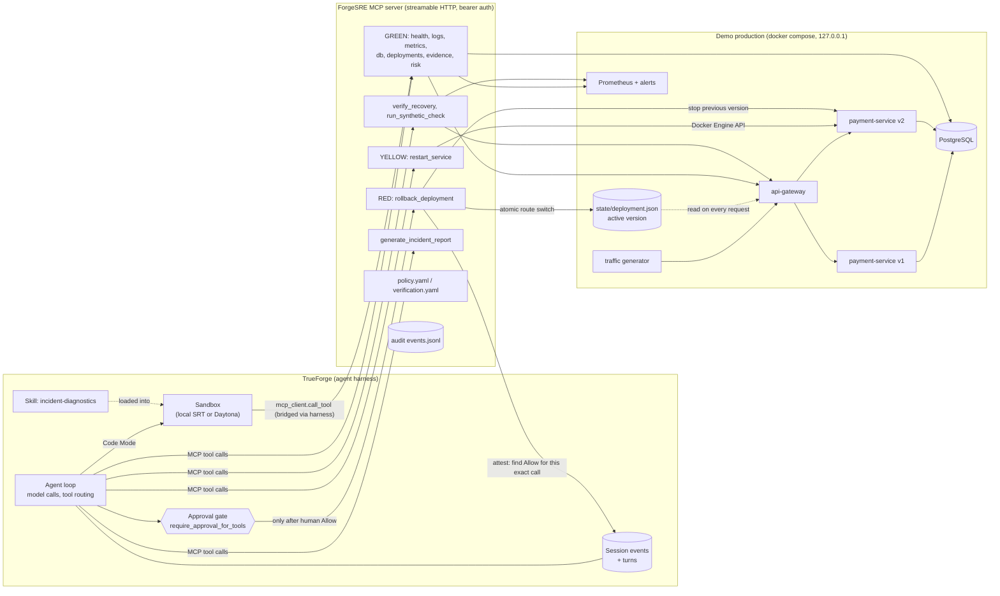

# Architecture

ForgeSRE has no agent loop of its own. TrueForge runs the loop; ForgeSRE supplies the systems, the tools, the
safety rules and the evidence.

## Why each piece exists

| Piece | Responsibility | Why it is here and not elsewhere |
|---|---|---|
| TrueForge | Model execution, tool selection, session state, sandbox, approval pause, trace | Required by the brief; we never call an LLM API ourselves |
| MCP server | Narrow, validated operations on real systems | The model gets capabilities, never a shell or raw Docker/PromQL/SQL |
| `policy.yaml` | Allowlists, rate limits, which actions are RED | Server-side defense in depth; the model is never the only boundary |
| Approval attestation | Rollback refuses to run unless TrueForge's own session records show a human Allow for this exact call (service, from, to), and each Allow is single-use | Makes the gate hold even if someone calls the MCP endpoint directly |
| `verification.yaml` | Objective recovery thresholds | "Looks fixed" is not a verdict; `verify_recovery` is |
| Audit log | Every tool call, action, verification | Report numbers are rendered from it, not written by the model |
| Skill + sandbox | Evidence analysis in code | Numbers are computed, not recalled; the sandbox holds no credentials |

## The incident, mechanically

`payment-service` v2 adds an audit trail for payments ≥ $25. Each audit row is written in its own transaction on a
dedicated pooled connection, and transactions are committed in batches of `AUDIT_BATCH_SIZE` (100). The pool holds 85
connections, so a batch never fills, nothing is ever committed, and every audited payment strands one connection
`idle in transaction`. At 10 req/s the pool is exhausted in about ten seconds; from then on every request waits 2 s
for a connection and fails with `db_pool_timeout`.

Signals this produces, all real:

- gateway: `checkout_failed` logs, 5xx rate → ~100%, p95 → ~2.5 s
- payment-service v2: `db_pool_timeout` logs with `active_connections=85, pool_limit=85`
- Prometheus: `db_connections_active{version="v2"} = 85`, `pg_stat_activity_count` ≈ 92 of 100
- PostgreSQL: 85 sessions from `payment-service-v2` in state `idle in transaction`
- deployment history: v2 deployed ~20 s before the error spike

A restart releases the stranded connections, so v2 briefly works, then exhausts again within seconds — which is why
the agent's first, safe remediation fails verification and it has to reason its way to the rollback.

## Rollback, step by step (`ops.rollback`)

1. Validate: service allowlisted, versions exist, `from_version` is active, `to_version` differs, incident open.
2. Attest: find the human Allow for this exact call in TrueForge (turn inputs of the session), not previously used.
3. Ensure the target container is running; wait for `/ready`.
4. Atomically rewrite `state/deployment.json` (tmp + rename, flock) with a history record.
5. Poll the gateway's `/route` until it reports the new version.
6. Drain, then stop the previous version's container to release its database connections.
7. Record `action_completed`; the agent must still call `verify_recovery`.
