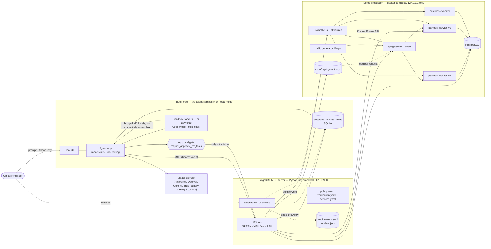
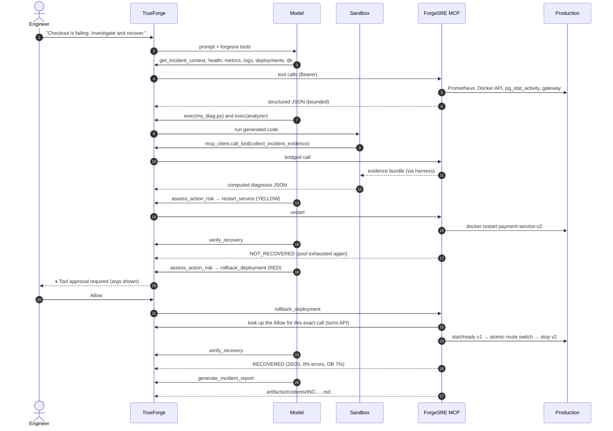
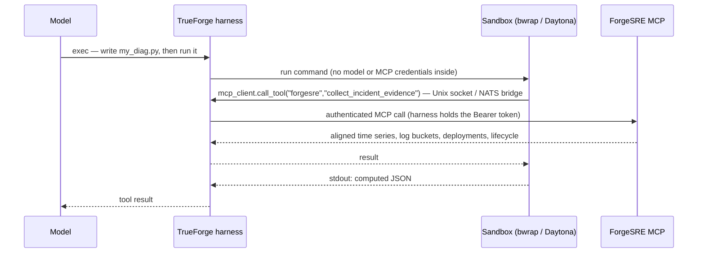
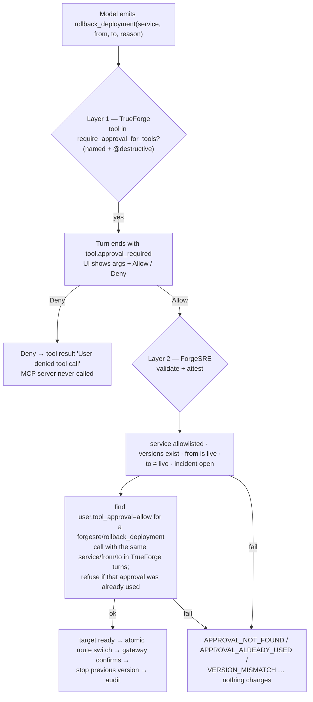

# Architecture

ForgeSRE has **no agent loop of its own**. TrueForge runs the loop — model calls, tool selection, the sandbox, the
approval pause, session state. ForgeSRE contributes four things around it: a real production system to operate, a
narrow MCP tool surface, deterministic safety rules, and evidence.

- [1. System context](#1-system-context)
- [2. Components](#2-components)
- [3. The incident lifecycle, end to end](#3-the-incident-lifecycle-end-to-end)
- [4. The sandbox path (Code Mode)](#4-the-sandbox-path-code-mode)
- [5. The approval boundary (two layers)](#5-the-approval-boundary-two-layers)
- [6. The demo production system](#6-the-demo-production-system)
- [7. State and data](#7-state-and-data)
- [8. Security boundaries](#8-security-boundaries)
- [9. Failure handling](#9-failure-handling)
- [10. Configuration](#10-configuration)

---

## 1. System context

**Who owns what**

| Concern | Owner | Mechanism |
|---|---|---|
| Reasoning, tool choice | TrueForge + the model | Agent loop; ForgeSRE never calls an LLM |
| Real-world reads and actions | ForgeSRE MCP server | 17 narrow tools, validated inputs, catalogued targets |
| "Is this action allowed at all?" | ForgeSRE policy | Allowlists, rate limits, eligibility, incident requirement |
| "Did a human approve this exact call?" | TrueForge gate, re-checked by ForgeSRE | `require_approval_for_tools` + attestation from TrueForge turns |
| Computing a diagnosis | TrueForge sandbox | Code the agent writes + reference analyzer, evidence via bridged `mcp_client` |
| "Did it work?" | ForgeSRE verification | `verify_recovery` against thresholds in config |
| Record of what happened | Both | TrueForge session trace; ForgeSRE audit log → incident report |

---

## 2. Components

| Component | Tech | Where | Responsibility |
|---|---|---|---|
| TrueForge 0.2.1 | Node, SQLite (local mode) | `:8790`, data in `.trueforge/` | Agent loop, chat UI, sandbox, approvals, sessions |
| ForgeSRE MCP server | Python 3.11+, official `mcp` SDK v2 (`MCPServer`), Starlette/uvicorn | `:18900/mcp` | Tool surface, policy, attestation, audit, dashboard |
| Mission control | Static HTML + `/api/state` | `:18900/dashboard` | Read-only view of health, signals, loop phase, approval banner |
| api-gateway | FastAPI + httpx | `:18080` | Public `/checkout`; routes to the version named in `state/deployment.json` |
| payment-service v1 / v2 | FastAPI + psycopg pool | `:18101` / `:18102` | Writes payments to PostgreSQL; v2 is the faulty release |
| PostgreSQL 16 | `max_connections=100`, `reserved_connections=3` | `:15432` | Payments DB; `forgesre_monitor` role (pg_monitor) for the MCP server |
| postgres-exporter | Prometheus community image | internal | `pg_stat_activity_count`, `pg_settings_max_connections` |
| Prometheus 3 | 2 s scrape, 5 s rule eval | `:19090` | Metrics and three symptom alerts |
| traffic generator | asyncio, open-loop 10 rps | internal | Steady customer load |
| Analyzer skill | Python, no deps | `skills/incident-diagnostics` | Reference diagnosis run inside the sandbox |
| Operator CLI | `forgesre` (same package) | scripts | deploy / reset / check / trueforge-setup / agent-run |

Everything in the demo binds to `127.0.0.1`. TrueForge `0.2.1` does not support stdio MCP, and its outbound URL
protections reject loopback MCP endpoints. Setup keeps those protections unchanged and requires an approved reachable
non-loopback endpoint in `FORGESRE_MCP_URL`; it does not publish the local development service.

---

## 3. The incident lifecycle, end to end

Two properties are deliberate:

1. **Action ≠ success.** Every mutating tool returns "done, now verify". The restart *succeeds* as an operation and
   still fails verification, which forces the agent back into investigation.
2. **The model proposes, the harness disposes.** The rollback call exists in the session before anyone has approved
   it, but the MCP server never sees it until the human clicks Allow.

---

## 4. The sandbox path (Code Mode)

- The **agent writes its own script** (step 5a of the instructions) and then runs the reference analyzer as a
  cross-check (5b). Both compute from the evidence bundle; neither contains a conclusion.
- The reference analyzer is shipped as a git-backed TrueForge **skill**. TrueForge's Linux local sandbox cannot run
  git's HTTPS helper when it lives in `/usr/libexec` (Fedora/RHEL), and a skill that fails to clone breaks sandbox
  start-up. `setup-trueforge.sh` detects this and instead has the agent pull the same file **through the MCP bridge**
  from inside the sandbox (`mcp-client call-tool forgesre get_reference_analyzer`), so the code never passes through the
  conversation and no internet access is needed. On Daytona, macOS and Debian/Ubuntu the skill attaches normally.
- TrueForge blocks destructive tools inside Code Mode, so a sandbox script cannot call `rollback_deployment`.

---

## 5. The approval boundary (two layers)

Layer 1 is what the judges see. Layer 2 is why it still holds if somebody (or something) calls the MCP endpoint
directly, replays an old approval, or approves a different call than the one being executed.

**Decision boundary**

| Class | Tools | Who decides |
|---|---|---|
| GREEN | 12 read tools, `run_synthetic_check`, `verify_recovery`, `generate_incident_report` | Agent, autonomously |
| YELLOW | `restart_service` | Agent, if `assess_action_risk` has no blockers; allowlist + 2 per 10 min per target; never `postgres` |
| RED | `rollback_deployment` | A human in TrueForge, then re-verified by the server |
| Never | shell, raw Docker, raw PromQL/SQL, deletes, DB changes | Not exposed at all |

---

## 6. The demo production system

**Normal:** the gateway reads `state/deployment.json` on every request (mtime-cached) and forwards `/checkout` to the
active payment-service version. v1 uses a 10-connection pool and returns connections after each request.

**The fault (v2):** v2 adds an audit trail. For payments ≥ $25 it takes a dedicated connection, opens a transaction,
inserts an audit row and parks the connection in a batch that commits every `AUDIT_BATCH_SIZE` (100). The pool
holds 85. The batch never fills, nothing commits, every audited payment strands one connection
`idle in transaction`, and within ~10 s at 10 rps the pool is exhausted. Each request then waits 2 s for a
connection and fails with `db_pool_timeout`.

| Signal | Healthy (v1) | Incident (v2) | Source |
|---|---|---|---|
| Checkout error rate | 0 % | ~100 % | gateway `http_requests_total` |
| Checkout p95 | ~50 ms | ~2.5 s | gateway histogram |
| v2 pool in use | – | 85 / 85 | `db_connections_active` |
| PostgreSQL connections | ~7 % | ~91 % | exporter / `pg_stat_activity` |
| Top backend log event | – | `db_pool_timeout` | container logs |
| Alerts | none | CheckoutErrorRateHigh, CheckoutLatencyHigh, DatabaseConnectionsHigh | Prometheus rules |

A restart releases the stranded connections, so v2 works for about ten seconds and then fails again — which is why
the safe action fails verification. Nothing in tools, metadata or commit messages says "v2 is broken".

**Deployment control** (`mcp-server/src/forgesre/deployment.py`): `record_switch` takes an `flock`, rewrites the
state file atomically (tmp + rename) with a history entry, and the gateway picks it up on its next request.
`scripts/trigger-incident.sh` uses the same code path as the release pipeline ("deploy v2"); the rollback tool uses it
in reverse and then stops the previous container to release its connections.

---

## 7. State and data

| Path | Written by | Read by | Contents |
|---|---|---|---|
| `state/deployment.json` | CLI deploy, `rollback_deployment` | gateway, tools, dashboard | active version per service, full history |
| `state/incident.json` | `get_incident_context` (auto-open on firing alerts), report | tools, dashboard, report | incident id, alerts and signal snapshot at open |
| `artifacts/audit/events.jsonl` | every tool call, action, verification | report, dashboard, rate limits, attestation replay check | append-only structured events |
| `artifacts/incidents/INC-*.md/.json` | `generate_incident_report` | humans | report + raw events |
| `.trueforge/trueforge.sqlite` | TrueForge | TrueForge, attestation, dashboard | sessions, turns, events, agent spec |
| `.run/` | scripts | scripts | pids, logs, last session |

Reset (`scripts/reset-demo.sh`) removes v2, rewrites the baseline route, archives the audit log, truncates demo
tables and recreates Prometheus with an empty TSDB, then waits until at least 45 s of healthy history exists.

---

## 8. Security boundaries

| Boundary | Control |
|---|---|
| Network exposure | Every port bound to 127.0.0.1; TrueForge outbound allowlist limited to loopback |
| MCP endpoint | `Authorization: Bearer $FORGESRE_MCP_TOKEN` (constant-time compare); token stored in the TrueForge connector, never in the agent spec |
| Model / MCP credentials | Stay in TrueForge; the sandbox receives neither (Code Mode bridges calls) |
| Database access | `forgesre_monitor` with `pg_monitor` + reserved connections; no write role in the MCP server |
| Docker access | Only catalogued containers; operations limited to inspect/logs/restart/start/stop; compose invoked with fixed argv |
| Inputs | Regex-validated names and versions, catalog lookups, bounded windows/limits, Literal enums for signals |
| Outputs | Bounded logs, secrets and DSN passwords redacted |
| Secrets in git | `.env` ignored; `setup.sh` generates random secrets |

---

## 9. Failure handling

Every tool returns `success`, `status` (`success` · `failure` · `partial` · `invalid_input` · `timeout`) and an
`error_code` the agent can reason about.

| Situation | Behaviour |
|---|---|
| Rollback target not ready | `TARGET_NOT_READY`, traffic not switched |
| Gateway does not confirm the new route in 10 s | `partial`, audit records it |
| Already on the target version | `ALREADY_AT_TARGET`, no change (idempotent) |
| Restart budget used | `RATE_LIMITED`; the agent must escalate |
| TrueForge unreachable during attestation | `APPROVAL_UNVERIFIABLE`, nothing changes |
| Prometheus or DB unreachable | `PROMETHEUS_UNAVAILABLE` / `DB_UNREACHABLE` / `DB_CONNECTIONS_EXHAUSTED` |
| Missing data during verification | criterion counts as failed — never as healthy |
| Incomplete config | server refuses to start (validated at load) |

---

## 10. Configuration

| File | Purpose |
|---|---|
| `config/services.yaml` | Service catalog: containers, URLs (with `${PORT}` interpolation), versions, dependencies |
| `config/policy.yaml` | Action classes, restart allowlist and budget, rollback eligibility, attestation switch |
| `config/verification.yaml` | Recovery thresholds, settle time, synthetic probe count, evidence/log bounds |
| `.env` | Secrets, ports, model provider, skill settings |
| `agent/forgesre.system.md` | Agent instructions (the `{{DIAGNOSTICS_SOURCE}}` placeholder is filled by setup) |
